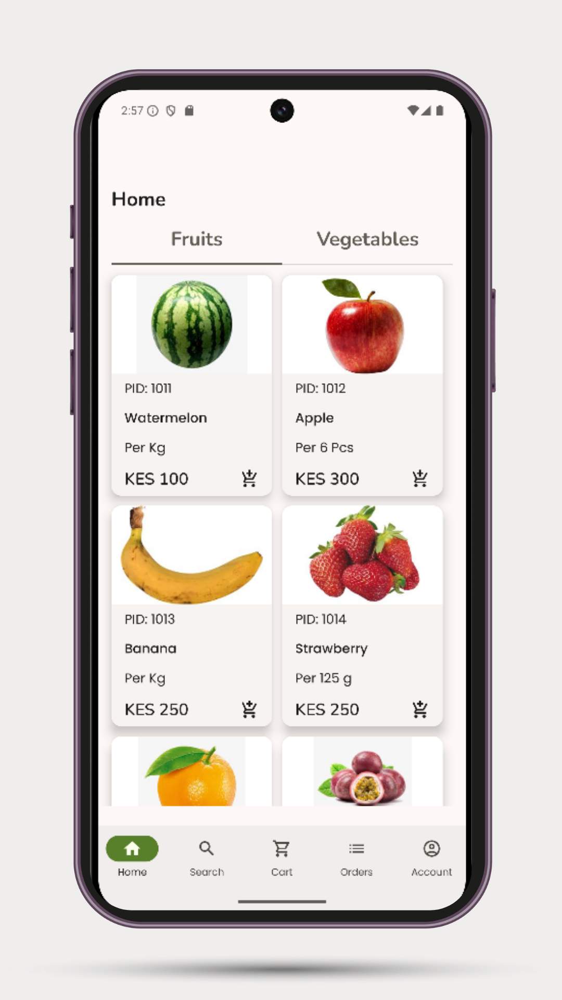
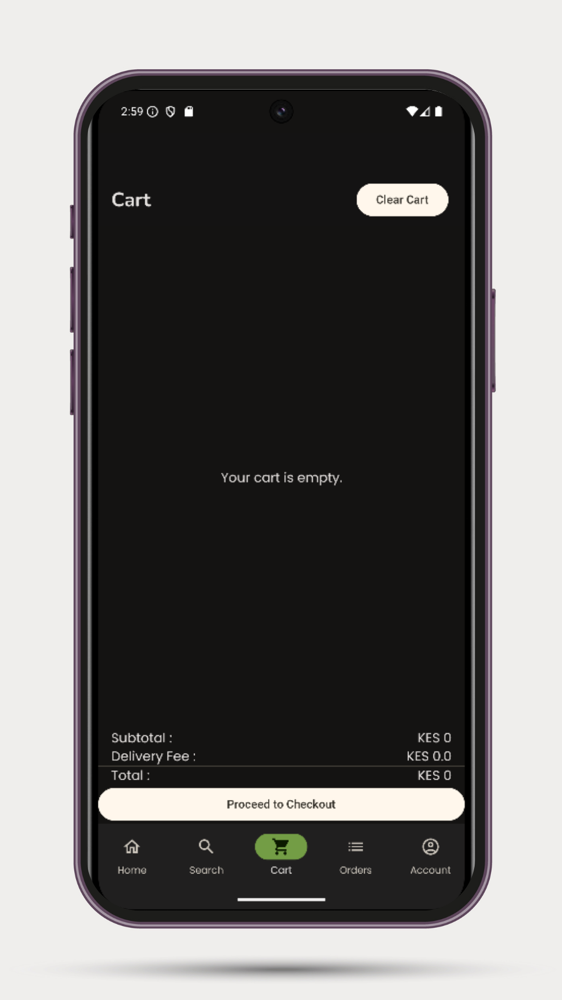
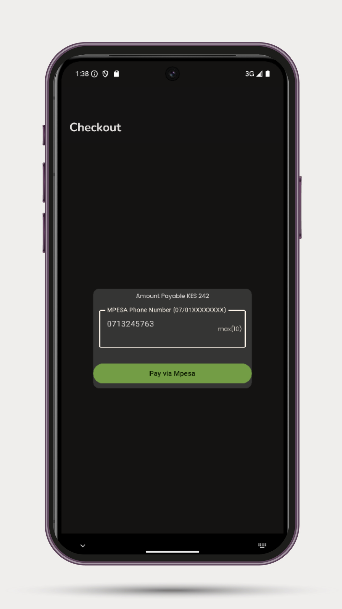

# Kibanda - Kenyan Grocery Shopping App

**Kibanda** is a native Android grocery shopping app designed for Kenyan users, built with **Kotlin**, **Jetpack Compose**, **Koin**, **Firebase**, and **MPesa** integration. It provides a seamless, secure and beautiful shopping experience for groceries such as fruits and vegetables directly from your Android mobile device.

![Kibanda Logo]

---

## 🛠️ Tech Stack

- **Kotlin** – Modern language for Android development  
- **Jetpack Compose** – Declarative UI framework  
- **Koin** – Lightweight dependency injection  
- **Firebase** – Authentication, Firestore Database  
- **MPesa API** – Safaricom Lipa na MPesa integration  
- **MVVM** – Clean architecture for scalability and testability  

---

## 🚀 Features

- 🔐 **User Authentication** – Sign up, Login, Logout using Firebase  
- 🛒 **Grocery Shopping** – Browse, search, and filter fruits & vegetables  
- 🧺 **Smart Cart** – Add, remove, and adjust quantity before checkout  
- 💳 **MPesa Payment** – Pay easily via Lipa na MPesa  
- 📦 **Order History** – Track all your past purchases  
- 🚚 **Delivery Tracking** – Monitor real-time delivery status  
- 🏷️ **Category Browsing** – Swipeable categories with a horizontal pager  
- 📱 **Responsive UI** – Fluid experience across all devices  

---

## 📷 App Screenshots

### 🏠 Home Screen  
![Home Screen]

### 🛒 Cart View  
![Cart Screen]

### 💳 MPesa Payment Flow  
![MPesa Payment]

---

## 📥 How to Access Kibanda (Before Google Play Release)

Since Kibanda is not yet on the Play Store, you can download and test it via GitHub:

### 🔧 Installation Steps

1. **Download the APK**  
   - Go to the [Releases](https://github.com/your-username/kibanda/releases) section  
   - Download the latest `Kibanda.apk`  

2. **Allow Installation from Unknown Sources**  
   - Go to your phone settings → Security → Enable *Install from Unknown Sources*  

3. **Install the APK**  
   - Tap the downloaded APK and install it  

4. **Launch the App**  
   - Sign up with your email, explore the groceries, and try the full shopping experience  

> 📲 Make sure your MPesa number matches the phone used during checkout.

---

## 🔐 Onboarding Process

1. **Launch App** → Splash screen loads  
2. **Sign Up/Login** → Firebase authentication  
3. **Home Screen** → Browse fruits and vegetables  
4. **Search or Filter** → By name or price  
5. **Add to Cart** → Adjust quantities  
6. **Checkout** → Complete purchase via MPesa  
7. **Order Confirmation** → Track delivery  

---

## 🧑‍💻 Contributing

Want to contribute to Kibanda?

1. Fork this repo  
2. Create your feature branch (`git checkout -b feature/cool-feature`)  
3. Commit your changes (`git commit -am 'Add cool feature'`)  
4. Push to the branch (`git push origin feature/cool-feature`)  
5. Create a new Pull Request  

---

## 📧 Contact

**Developer:** Stanley Kienji  
📩 Email: [kienji254@gmail.com](mailto:kienji254@gmail.com)  
📱 Phone: +254 719 323117  
🌍 Location: Kenya  

---

## 📝 License

This project is licensed under the MIT License - see the [LICENSE](LICENSE) file for details.

---

> **Kibanda** – Bringing the market to your pocket 🇰🇪🛒
